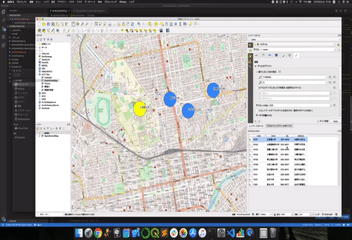
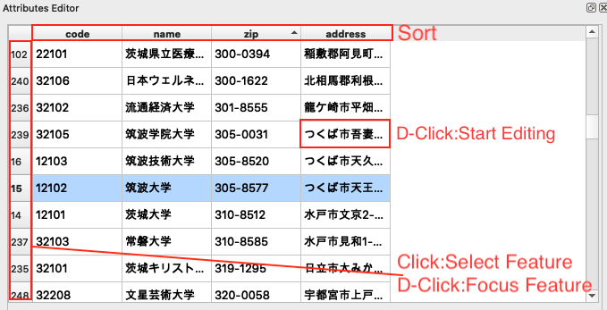

# AttrubytesEditor
QGIS plugin to show and edit Attributes of features easily.

# Sample

# Usage

- You can show and edit attributes of features in only active layer.

# Contact
kanahiro.iguchi@gmail.com